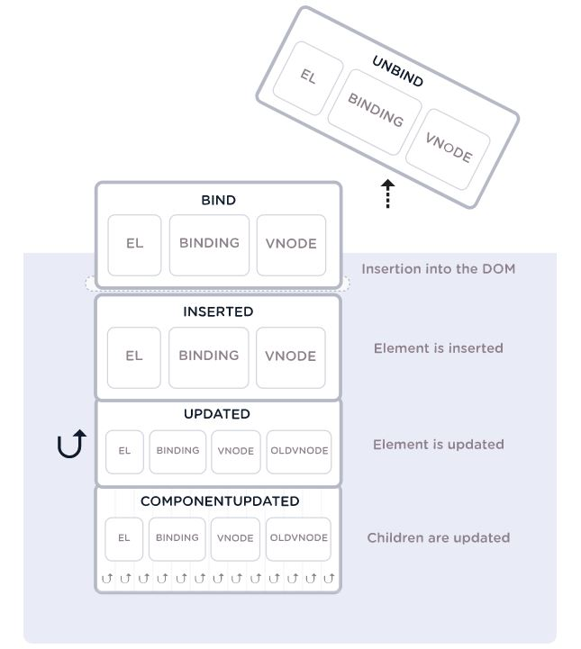

---

<div align="center">
    <p>Vuejs Technical Interview Questions & Answered</p>
</div>

---

### Table of Contents

| No. | Questions |
| --- | --------- |
|1  | [What is Vue?](#what-is-Vue) |
|2  | [What is advantages of Vue?](#What-is-advantages-of-Vue) |
|3  | [Explain Vue.js reactivity and common issues when tracking changes?](#Explain-Vue.js-reactivity-and-common-issues-when-tracking-changes) |
|4  | [What is the virtual DOM and how is it beneficial?](#what-is-the-virtual-DOM-and-how-is-it-beneficial) |
|5  | [What are Components in Vue.js](#what-are-Components-in-Vue.js) |
|6  | [Why do we need local registration?](#Why-do-we-need-local-registration?) |
|7  | [What are list of features in Vue.js](#what-are-list-of-features-in-Vue.js) |
|8  | [What are the event modifiers available in Vue.js](#what-are-the-event-modifiers-available-in-Vue.js) |
|9  | [Explain how can we work with binding inline styles?](#Explain-how-can-we-work-with-binding-inline-styles) |
|10  | [List type of Directive are available in Vuejs?](#List-type-of-Directive-are-available-in-Vuejs) |
|11  | [What are Directives in VUE.js, List some of them you used?](#What-are-Directives-in-VUE.js,-List-some-of-them-you-used) |
|12  | [What is Vue loader?](#what-is-Vue-loader) |
|13  | [How will you render the original HTML in the template?](#How-will-you-render-the-original-HTML-in-the-template) |
|14  | [Explain lifecycle hooks in vue.js?](#Explain-lifecycle-hooks-in-vue.js) |
|15  | [How to listen to events?](#How-to-listen-to-events) |
|16  | [Which lifecycle hook is most suitable for getting data from API calls?](#Which-lifecycle-hook-is-most-suitable-for-getting-data-from-API-calls) |
|17  | [When is the updated lifecycle hook called?](#When-is-the-updated-lifecycle-hook-called) |
|18  | [Why not use the arrow function when writing a lifecycle hook or other option or property in a Vue instance?](#Why-not-use-the-arrow-function-when-writing-a-lifecycle-hook-or-other-option-or-property-in-a-Vue-instance) |
|19  | [What is asynchronous component?](#what-is-asynchronous-component) |
|20  | [What is the difference between v-show and v-if directives?](#What-is-the-difference-between-v-show-and-v-if-directives) |
|21  | [What are rendering functions? for instance](#what-are-rendering-functions-for-instance) |
|22  | [What is mixin?](#what-is-mixin) |
|23  | [How does prop specify its type requirements?](#How-does-prop-specify-its-type-requirements) |


1. ### What is Vue?

   Vue is a **progressive framework** used to building user interfaces. The core library is focused on the view layer only, and is easy to pick up and integrate with other libraries or existing projects.


   **[⬆ Back to Top](#table-of-contents)**

2. ### What is advantages of Vue?

   1. **Small in size** — The size of Vue framework is 18 to 21KB and it takes no time for the user to download and use it.
   2. **Easy to Understand** — One of the reasons for the popularity of this framework is that it is quite easy to understand. The user can easily add Vue.js to his web project because of its simple structure.
   3. **Simple Integration** — Vue.js can be integrated with the existing applications easily.
   4. **Flexibility** — This flexibility also makes it easy to understand for the developers of React.js, Angular.js, and any other new JavaScript framework.
   5. **Virtual DOM** — It uses virtual DOM similar to other existing frameworks such as ReactJS, Ember etc. Virtual DOM is a light-weight in-memory tree representation of the original HTML DOM and updated without affecting the original DOM.
   6. **Components** — Used to create reusable custom elements in VueJS applications.
   7. **Two-Way Communication** — Vue.js also facilitates two way communications because of its MVVM architecture which makes it quite easy to handle HTML blocks.


   **[⬆ Back to Top](#table-of-contents)**

3. ### Explain Vue.js reactivity and common issues when tracking changes?

   All properties defined in a Vue instance’s data option are reactive, meaning that if they change, the component is automatically updated and re-rendered as needed.
   All such properties are converted to getters and setters during initialization, thus allowing Vue to detect when those properties are accessed or changed.
   The following limitations must be accounted for when designing a Vue app:

   Vue cannot detect object property addition or deletion due to a JavaScript limitation, so the Vue.set method must be used to add new root-level reactive properties.
   Similarly, Vue cannot detect when an array item is modified using an index. Vue.set must be used here as well.

   **[⬆ Back to Top](#table-of-contents)**

4. ### What is the virtual DOM and how is it beneficial?

   The **virtual DOM** is a tree-like data structure (or a collection) of JavaScript objects representing DOM nodes that are managed by Vue.js and that should be rendered on the page. These objects are called “virtual nodes” or VNodes for short.

   The main purpose of the virtual DOM is faster and more efficient DOM manipulation. When there are lots of nodes in the DOM, updating them can be expensive in terms of processing power and resources required.

   Working with the virtual DOM JavaScript object is significantly faster. Subsequently, Vue.js organizes DOM updates in batches for more efficiency.

   **[⬆ Back to Top](#table-of-contents)**


5. ### What are Components in Vue.js?

   Components are one of most powerful features of Vue js.In Vue components are custom elements that help extend basic HTML elements to encapsulate reusable code.

   Following is the way to register a Vue component inside another component:

   ```
    export default {
      el: '#your-element',
      components: {
          'your-component'
      }
    }
   ```

   **[⬆ Back to Top](#table-of-contents)**

6. ### Why do we need local registration?

   Global registration often isn’t ideal. For example, if we are using a build system like Webpack, globally registering all components means that even if we stop using a component, it could still be included in our final build. This unnecessarily increases the amount of JavaScript your users have to download. In these cases, you can define your components as plain JavaScript objects:

   ```
    const ComponentA =  {/* ..... */}
    const ComponentB =  {/* ..... */}
    const ComponentC =  {/* ..... */}
   ```
   Then define the components you’d like to use in a components option:  

   ```
    export default {
      el: '#app',
      components: {
          'component-a': 'ComponentA',
          'component-b': 'ComponentB',
          'component-c': 'ComponentC',
      }
    }
   ```

   **[⬆ Back to Top](#table-of-contents)**


7. ### What are list of features in Vue.js?

   Vue js comes with following features

    1. **Templates**
    2. **Reactivity**
    3. **Components**
    4. **Transitions**
    5. **Routing**


   **[⬆ Back to Top](#table-of-contents)**

8. ### What are the event modifiers available in Vue.js?

   The list of available event modifiers is given below:

   1. stop
   2. prevent
   3. capture
   4. self
   5. once
   6. passive


   **[⬆ Back to Top](#table-of-contents)**

9. ### Explain how can we work with binding inline styles?

   V-bind: style can be used as a code that is straightforward in inline style binding. The look is closely similar to CSS except for its JavaScript feature. Either kebab-case or camelCase can be used for the CSS property names. Shown below is a sample snippet code:

   ```
      <div v-bind:style="{ color: activeColor, fontSize: fontSize + 'px' }"></div>
      data: {
      activeColor: 'red',
      fontSize: 30
      }
   ```


   **[⬆ Back to Top](#table-of-contents)**

10. ### List type of Directive are available in Vuejs?

    Following is list of directives available in Vue.js:

    1. **Empty Directives** - Empty directives do not require and will ignore their attribute value. e.g. v-pre(skip) and v-cloak (display: none).

    ```
        <div v-pre>
        <!-- markup in here will not be compiled -->
        </div>
    ```
    2. **Custom Directive** - Vue also allows us to register our own custom directives aside the default set of directives that are shipped in core (v-show and v-model). In Vue 2.0, the primary code reuse and abstraction is components- however there may be cases where we need some low-level DOM access on plain elements, custom directives will still be useful here. A typical example would be focusing on an input element, like an input text.

    On page load, the element gains focus (Note: autofocus does not work on mobile safari). If one has not clicked on anything else since visiting the page, the text input should be focused. Let us build the directive that will accomplish this:

    ```
    // Registering a global custom directive called `v-focus`
    Vue.directive('focus', {
      // When the bound element is inserted into the DOM...
      inserted: function (el) {
        // Focus the element
        el.focus()
      }
    })
    ```
    Instead if we want to register a directive locally, components accept directives option as well:
    ```
    directives: {
      focus: {
        // directive definition
        inserted: function (el) {
          el.focus()
        }
      }
    }
    ```
    Then we can now use the new v-focus attribute on any element in our template as shown:
    ```
    <input v-focus>
    ```
    Hook Functions

    Several hook functions can be provided by a directive's definition object:

    1. **bind**: This is called only once, when the directive is first bound to the element. This is where we can do one-time setup work.
    2. **inserted**: This is called when the bound element has been inserted into its parent node (this only guarantees the parent node presence, not necessarily in-document).
    3. **update**: This is called after the containing component's VNode has updated, but possibly before the update of its children. The value of the directive may or may not have changed, but we can skip unnecessary updates by comparing the binding's current and old values (see hook arguments below).
    4. **componentUpdated**: This is called after the containing component's VNode and the VNodes of its children have updated.
    5. **unbind**: This is called only once, when the directive is unbound from the element.

    

    3. **Literal Directives** - Some directives don’t create data bindings - they simply take the attribute value as a literal string. For example the v-component directive:

      ```
        <div v-component="my-component"></div>
      ```
    Here "my-component" is not a data property - it’s a string ID that Vue.js uses to lookup the corresponding Component constructor.

    4. **General Directives** -


    **[⬆ Back to Top](#table-of-contents)**

11. ### What are Directives in VUE.js, List some of them you used?

    Directives in Vue.js extend HTML with attributes and tags. Vue.js has built-in directives, but you can also make your custom directives. Following is a list of some directives used:

    1. v-else
    2. v-on
    3. v-model
    4. v-show
    5. v-if


    **[⬆ Back to Top](#table-of-contents)**

12. ### What is Vue loader?

    Vue loader is the loader module of webpack, which enables us to write single file components in. Vue file format. A single file component file has three parts: template, script, and style. The Vue loader module allows webpack to extract and process each part using a separate loader module, such as sass or SCSS loader. This setting allows us to write programs seamlessly using. Vue files.

    The Vue loader module also allows static resources to be treated as module dependencies and to be processed using the webpack loader. It also allows for hot reloading during development.    


    **[⬆ Back to Top](#table-of-contents)**

13. ### How will you render the original HTML in the template?

    A typical way to output content in a template is to use the mustache syntax tag to output data from a method, property, or data variable. But the mustache tag renders the text. If you try to render HTML using the mustache tag, it will render as a text string and will not be parsed. To render and parse content into HTML, we can use the v-html directive, as shown below.

    ```
      <p>Using mustaches: {{ rawHtml }}</p>
      <p>Using v-html directive: <span v-html="rawHtml"></span></p>
    ```

    ```
      Using mustaches: <span style="color:red">This should be red</span>
      Using v-html directive: This should be red
    ```
    The contents of the span will be replaced with the value of the rawHtml property, interpreted as plain HTML - data bindings are ignored. Note that you cannot use v-html to compose template partials, because Vue is not a string-based templating engine. Instead, components are preferred as the fundamental unit for UI reuse and composition.


    **[⬆ Back to Top](#table-of-contents)**

14. ### Explain lifecycle hooks in vue.js?

    Lifecycle hooks are an important part of any serious component. You often need to know when your component is created, added to the DOM, updated, or destroyed. Lifecycle hooks are a window into how the library you’re using works behind-the-scenes.

    1. **beforeCreate**  — This is the first hook that gets called after the Vue instance has been initialized. At this stage, data observation (reactivity), events, computed properties and watchers are yet to be set up. Therefore, we cannot interact with any parts of the component.

    2. **Created**  — This hook is called after the instance is created. At this stage, the instance has finished processing, data observation (reactivity), computed properties, methods, watchers and event callbacks have been set up. You can’t interact with the DOM at this stage because your component has not been mounted. The $el property is not also available yet.

    3. **beforeMount**  — At this stage, the template is compiled, either from the template or render options, or from the outerHTML of the element that Vue was initialized to. The template isn’t rendered yet and the $el method doesn’t exist either. Please note that this hook is not called during sever-side rendering.

    4. **Mounted**  — Called after the instance has been mounted, where el property is replaced by the newly created vm.$el. If the root instance is mounted to an in-document element, vm.$el will also be in-document when mounted is called. The component becomes fully functional after the mounted hook is called and we can fully interact with it.

    5. **beforeUpdate**  — It is called anytime changes are made to our data and the DOM needs to be updated, right before the DOM is patched. This is a good place to access the existing DOM before an update, e.g. to manually remove an added event listeners. This hook is not called during server-side rendering, because only the initial render is performed at server-side.

    6. **Updated**  — Hook is fired after a change has been made. The component’s DOM would have been updated when this hook is called, so you can perform DOM-dependent operations here. However, in most cases you should avoid changing state inside the hook

    7. **beforeDestroy**  — Called right before a Vue instance is destroyed. At this stage the instance is still fully functional. You can perform necessary cleanups here. Please note that this hook is not called during sever-side rendering.

    8. **Destroyed**  — Called after a Vue instance has been destroyed. When this hook is called, all directives of the Vue instance have been unbound, all event listeners have been removed, and all child Vue instances have also been destroyed. Please note that this hook is not called during sever-side rendering.


    **[⬆ Back to Top](#table-of-contents)**

15. ### How to listen to events?

    We can use the v-on directive to listen to DOM events and run some JavaScript when they’re triggered.

    ```
      <div id="example-1">
        <button v-on:click="counter += 1">Add 1</button>
        <p>The button above has been clicked {{ counter }} times.</p>
      </div>
    ```
    ```
      var example1 = new Vue({
        el: '#example-1',
        data: {
          counter: 0
        }
      })
    ```


    **[⬆ Back to Top](#table-of-contents)**

16. ### Which lifecycle hook is most suitable for getting data from API calls?

    Although this depends on the purpose and purpose of the component, the **created** life cycle hook is usually very suitable for placing API calls. You can use the data and responsiveness features of the component, but the component has not yet rendered.


    **[⬆ Back to Top](#table-of-contents)**

17. ### When is the updated lifecycle hook called?

    After the responsive data is updated and the virtual DOM is re rendered, the updated hook is called. It can be used to perform DOM related operations, but (by default) there is no guarantee that subcomponents will be rendered, although it can also be used in update functions **this.$nextTick** To ensure that.


    **[⬆ Back to Top](#table-of-contents)**

18. ### Why not use the arrow function when writing a lifecycle hook or other option or property in a Vue instance?

    Arrow function is not defined by itself **this** Context, but bound to the context of its parent function. When you use arrow function in Vue program（=> When **this** Keyword disease is not bound to a Vue instance, so an error is raised. Therefore, it is strongly recommended to use the standard function declaration instead.


    **[⬆ Back to Top](#table-of-contents)**

19. ### What is asynchronous component?

    When a large program uses a large number of components, it may not make sense to load all components from the server at the same time. In this case, Vue allows us to define components that are loaded asynchronously from the server when needed. When declaring or registering a component, Vue accepts the factory function that provides promise. You can then “parse” the component when it is called.

    By loading only the basic components and delaying the loading of asynchronous components to the future call time, the bandwidth and program loading time can be saved.

    This is a simple example of an asynchronous component.

    ```
      new Vue({
          components: {
              ‘tweet-box’: () => import(‘./components/async/TweetBox’)
          }
      });
    ```
    When used in this way, webpack’s code splitting will be used to provide this functionality.

    **[⬆ Back to Top](#table-of-contents)**

20. ### What is the difference between v-show and v-if directives?

    Below are some of the main differences between between v-show and v-if directives,

    * v-if only renders the element to the DOM if the expression passes whereas v-show renders all elements to the DOM and then uses the CSS display property to show/hide elements based on expression.
    * v-if supports v-else and v-else-if directives whereas v-show doesn't support else directives.
    * v-if has higher toggle costs while v-show has higher initial render costs. i.e, v-show has a performance advantage if the elements are switched on and off frequently, while the v-if has the advantage when it comes to initial render time.
    * v-if supports <template> tab but v-show doesn't support.


**[⬆ Back to Top](#table-of-contents)**

21.   ### What are rendering functions? for instance.

    Vue allows us to build templates in a number of ways, the most common of which is to use only HTML with special instructions and mustache tags for response functions. But you can also use JavaScript to build templates using special function classes (called rendering functions). These functions are very close to the compiler, which means they are more efficient and faster than other template types. Because you use JavaScript to write rendering functions, you are free to use the language where you need to add custom functions directly.

    It is very useful for advanced solutions of standard HTML templates.

    **Here is the Vue program using HTML as a template** -

    ```
      new Vue({
        el: '#app',
        data: {
          fruits: ['Apples', 'Oranges', 'Kiwi']
        },
        template:
            `<div>
               <h1>Fruit Basket</h1>
               <ol>
                 <li v-for="fruit in fruits">{{ fruit }}</li>
               </ol>
            </div>`
      });
    ```
    **Here is the same program developed with rendering function** -

    ```
      new Vue({
        el: '#app',
        data: {
          fruits: ['Apples', 'Oranges', 'Kiwi']
        },
        render: function(createElement) {
          return createElement('div', [
            createElement('h1', 'Fruit Basket'),
            createElement('ol', this.fruits.map(function(fruit) {
              return createElement('li', fruit);
            }))
          ]);
        }
      });
    ```

    **Output** -
    ```
      Fruit Basket

      Apples
      Oranges
      Kiwi
    ```

    In the example above, we use a function that returns a series of createElement() Call, each of which is responsible for generating an element. Although the V-for instruction works in HTML based templates, when using rendering functions, you can simply use the standard.map() Function to traverse the fruits data array.


    **[⬆ Back to Top](#table-of-contents)**
